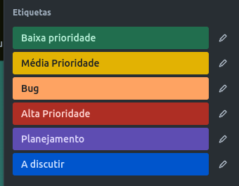

# Metodologia

Nesta seção descreveremos como a equipe se organizou para realizar o projeto, bem como as ferramentas e metodologia utilizada para a execução da tarefas geradas em cada etapa;

## Gerenciamento de Projeto

A metodologia ágil escolhida para o desenvolvimento do projeto foi o SCRUM. PRIKLADNICKI, WILLI e MILANI (2014. p. 44 - 45), descrevem dentre seus principais benefícios:

- “Prescreve um conjunto de práticas leves e objetivas”;
- “O Scrum maximiza a entrega de software de modo eficaz, adaptando-se à realidade das mudanças”;
- “As funcionalidades de maior valor são desenvolvidas antecipadamente, enquanto se reflete sobre a necessidade ou não das menos prioritárias”;
- “Se mudanças forem necessárias, a equipe ágil poderá facilmente mudar as prioridades”;
- “As entregas podem ser alteradas a qualquer momento, garantindo assim que o produto desenvolvido esteja absorvendo os acontecimentos externos e sendo fiel às reais necessidades do negócio”.

### Divisão de Papéis

Ainda tendo como base a metodologia Scrum, e seguindo PRIKLADNICKI, WILLI e MILANI (2014. p. 46), foi definida divisão dos membros do grupo pelo seguintes papéis:
- Scrum Master: Rafael Santos Carvalho;
- Product Owner: Felipe Costa Moreira;
- Equipe de Desenvolvimento: Felipe Costa Moreira, Gabriel Marchi Ziviani, João Henrique Andrade Leite, Paulo Henrique Sousa Carvalho, Rafael Santos Carvalho e Thainá Crisóstomo Bernardes; 
- Equipe de Design: Paulo Henrique Sousa Carvalho e Thainá Crisóstomo Bernardes; 

### Processo

Na área da tecnologia, existe um conjunto de atividades responsáveis pelo processo de criação, implantação e suporte da aplicação, essas atividades fazem parte do processo de desenvolvimento de software.

No projeto estamos desenvolvendo um processo de etapas e subetapas, onde o backlog, é considerado um espaço para reunir requisitos para o desenvolvimento do software e discussão do mesmo. Seguindo o desenvolvimento do processo, teremos o planejamento, nele discutimos o backlog entrando na fórmula de (tempo,prioridade e qualidade), consideramos que nesse triângulo nunca poderemos priorizar mais de dois paramêtros entre eles. Definindo as prioridades, o tempo e como será feito os requisitos, passaremos uma lista de requisitos(em uma ordem respectiva da maior para a menor prioridade).

Seguindo o processo, teremos a sprint, ela é considerada um espaço onde o cliente define os requisitos(que serão feitos em uma ordem de maior a menor prioridade) e com um tempo pré definido (esse tempo pré definido seria o tempo de duração de uma sprint até a outra para cada desenvolvedor), por exemplo, se tivermos dois desenvolvedores de uma sprint de 40 horas, teremos uma fila de requisitos de 80 horas, definindo as horas de cada requisito e alocando o tempo na sprint, teremos como resultado uma sprint bem implementada. 
Sendo assim, consideramos as subetapas acima a primeira etapa do processo.

O segundo processo é a área de desenvolvimento do software, para explicarmos essa área iremos contextualizar antes um pouco sobre o versionamento, no desenvolvimento podemos trabalhar com versões do software, essas versões muitas vezes são chamadas de incrementos, sendo que, esses incrementos dependem de algumas regras acordadas entre um grupo responsável pelo desenvolvimento de um projeto. 

Por exemplo, no nosso grupo temos uma versão principal que é a versão "MASTER", nessa versão "MASTER" estará o produto em desenvolvimento online(essa é uma das áreas mais importantes pois terá que passar por todo o processo e não poderá ter nenhum erro crítico com risco de danificar o sistema, pois se tivermos erros críticos na área de produção, a aplicação começará a dar muitos problemas), temos também "HOMO" que é uma versão de teste que a cada sprint resulta em "MASTER"(em "HOMO" podemos inserir nossas versões customizadas de cada requisito para que posssamos identificar as falhas e os resultados dos requisitos propostos). Teremos também as versões customizadas de cada requisito, essa versão é padronizada no projeto para seguir um esquema e ela sempre vai seguir "HOMO", porque todas as vezes que inserirmos um incremento em "HOMO" significa que "HOMO" ficou mais atualizada que "MASTER", então não saberemos se "MASTER" irá funcionar da maneira correta se não desenvolvermos em "HOMO", essas versões desenvolvidas pelos desenvolvedores podem dar conflitos com outras versões. Esses conflitos deverão ser resolvidos pelo desenvolvedor para poderem ir para "MASTER". 

Desse modo, explicando esse processo de versionamento e como ele funciona, poderemos continuar concluindo o nosso processo(lembrando que esse é um dos processos de versionamento existentes e foi o que achamos mais adequado para o desenvolvimento desse projeto.

No processo teremos uma lista de requisitos em "fazendo", isto é, os requisitos que estão sendo desenvolvidos pelos desenvolvedores(lembrando que o grupo acordou que a lista de requisitos "fazendo" sempre seguirá em "HOMO", após um desenvolvedor realizar um requisito, esse mesmo requisito irá para a lista de "finalizados", essa lista é uma verificação se o que foi pedido no requisito foi concluído e se foi feito da maneira correta e sem erros. 

Esse processo anterior é realizado tanto por um cliente(para que ele possa entender como o seu requisito irá funcionar e se está funcionando da maneira que ele imagina) tanto por um desenvolvedor que terá maior senioridade ou que terá a função de revisão de código e da qualidade do serviço, depois teremos a etapa de "concluído"(sendo uma lista de requisitos que passamos para a produção), teremos essa lista para o gerenciamento de requisitos desenvolvidos e demonstração do resultado para o cliente. 

Com isso, o processo foi inteiramente concluído nessas duas étapas(planejamento e desenvolvimento) e as subetapas("backlog", "planejamento", "sprint", "fazendo", "finalizado" e "concluído").

### Etiquetas

As tarefas são, ainda, etiquetadas em função da natureza da atividade e seguem o seguinte esquema de cores/categorias:

<ul>
  <li>Bug (Erro no código)</li>
  <li>Prioridade baixa verde</li>
  <li>Prioridade média laranja</li>
  <li>Prioridade alta preta</li>
</ul>

  
### Ferramentas

[Descreva aqui as ferramentas empregadas no projeto e os ambiente de trabalho utilizados pela  equipe para desenvolvê-lo. Abrange a relação de ambientes utilizados, a estrutura para gestão do código fonte, além da definição do processo e ferramenta através dos quais a equipe se organiza (Gestão de Times).]

Os artefatos do projeto são desenvolvidos a partir de diversas plataformas e a relação dos ambientes com seu respectivo propósito é apresentada na tabela que se segue.

| AMBIENTE                            | PLATAFORMA                         | LINK DE ACESSO                         |
|-------------------------------------|------------------------------------|----------------------------------------|
| Repositório de código fonte         | GitHub                             | http://....                            |
| Documentos do projeto               | GitHub                             | http://....                            |
| Projeto de Interface                | Figma                              | http://....                            |
| Gerenciamento do Projeto            | GitHub Projects                    | http://....                            |
| Hospedagem                          | GitHub Pages                       | http://....                            |

### Estratégia de Organização de Codificação 

Todos os artefatos relacionados a implementação e visualização dos conteúdos do projeto do site estão inseridos na pasta [codigo-fonte](https://github.com/ICEI-PUC-Minas-PMV-ADS/pmv-ads-2024-1-e1-proj-web-t6-pmv-ads-2024-1-e1-projeto_gpetshop/tree/main/codigo-fonte).
