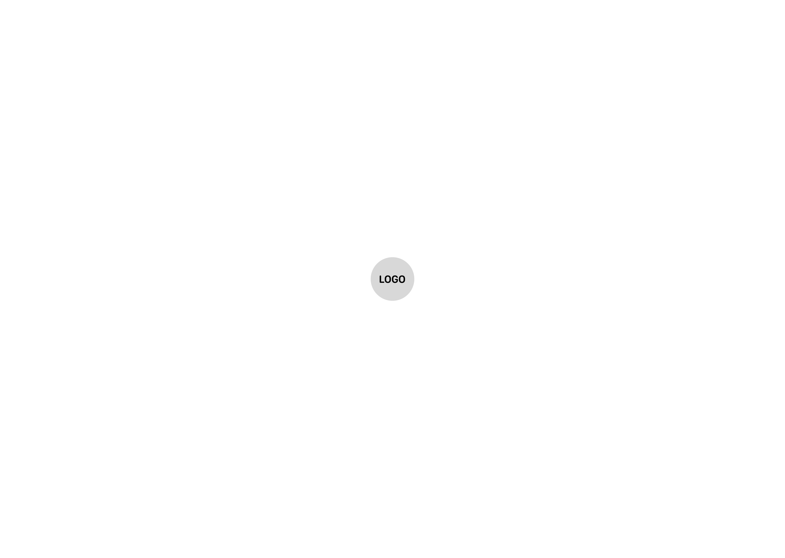
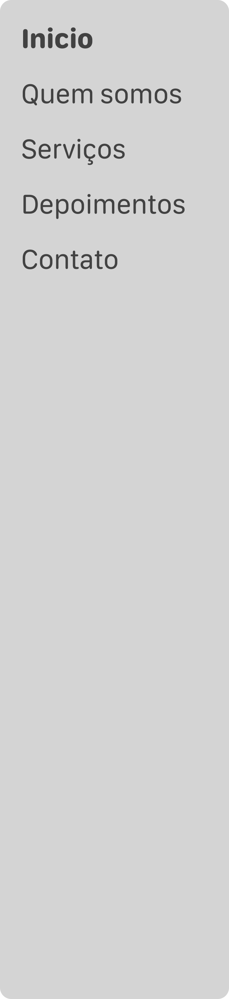
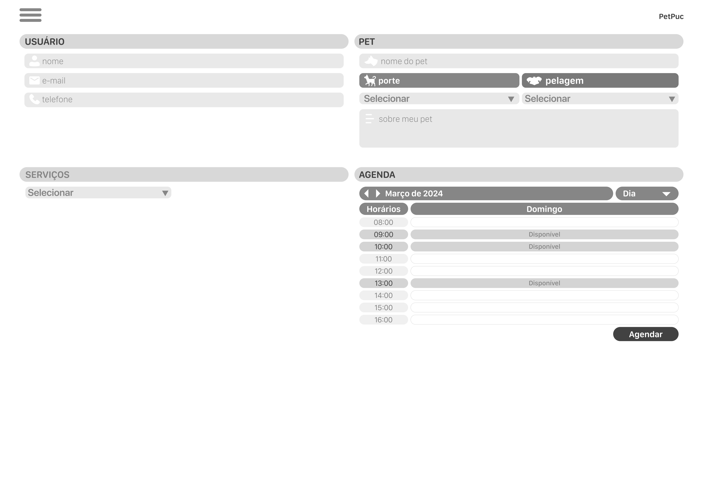
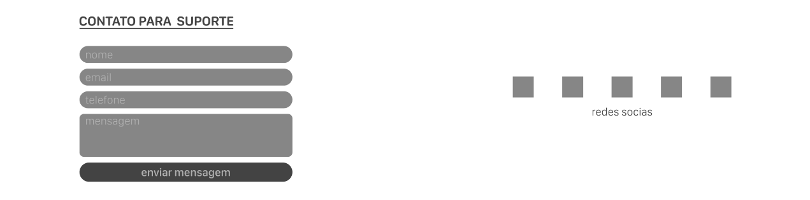

# Projeto de Interface

No sistema web de banho e tosa, o usuário é recebido com três alternativas na página inicial.

Primeiramente, ele pode explorar a landing page, onde encontrará informações detalhadas sobre os serviços oferecidos, além de imagens dos pets atendidos e depoimentos de clientes satisfeitos. Essa seção permite que o usuário se familiarize com o ambiente e os benefícios do serviço antes de tomar uma decisão.

Em seguida, o usuário pode optar por agendar um serviço para seu pet, preenchendo um formulário com informações sobre ele próprio e seu pet, selecionando o tipo de serviço desejado e escolhendo um horário disponível. Caso não encontre um horário adequado, será orientado a entrar em contato diretamente com o estabelecimento para agendar. Se escolher um horário disponível, receberá uma notificação de confirmação do agendamento para garantir que sua reserva tenha sido registrada com sucesso.

Por fim, o usuário também tem a opção de entrar em contato com a equipe de suporte, acessando a área disponível no rodapé da página principal. Lá, poderá preencher um formulário com seu nome, e-mail, telefone e mensagem, para receber assistência por e-mail ou WhatsApp conforme sua preferência.
 

## User Flow

 

> **Representação visual do User Flow**

* **🔴Vermelho:** Início e fim do user flow
* **🟠Laranja:** Ações principais deste user flow
* **🟢Verde:** Ações pertinentes ao usuário
* **🟡Amarelo:** Decisão

 

## Wireframes

Estas telas fazem parte de um sistema projetado para oferecer aos usuários uma experiência aprimorada e mais versátil ao agendar os serviços de banho e tosa oferecidos pelo estabelecimento.

<h3><ins> Tela de Abertura </ins></h3>

* **Tela de Abertura:** A tela de abertura apresenta apenas o logo do sistema, oferecendo uma entrada limpa e minimalista para os usuários. O seu propósito é estabelecer a identidade visual do sistema de forma simples e direta, preparando os usuários para navegarem pelas funcionalidades.

 

<h3><ins> Tela Principal </ins></h3>

* **Tela Principal:** Aqui são apresentados detalhes sobre os serviços oferecidos, incluindo imagens dos pets atendidos e depoimentos de clientes satisfeitos. Os usuários podem conhecer melhor os serviços prestados, visualizar exemplos do trabalho realizado e ler experiências de clientes anteriores para tomar uma decisão informada sobre os serviços.

 

<h3><ins> Barra de Navegação </ins></h3>

* **Barra de Navegação:** A barra de navegação está disposta ao topo esquerdo das páginas para facilitar a exploração do conteúdo disponível e uma navegação mais intuitiva para o usuário.

 

<h3><ins> Tela de Agendamento / Requisição </ins></h3>

* **Tela de Agendamento / Requisição:** O tela de agendamento de serviços exibe um formulário claro e intuitivo, dividido em seções para informações do usuário e do pet, seleção de serviço e escolha de horário. Os campos são organizados de forma lógica e fácil de preencher.

 

<h3><ins> Seção de Contato com Suporte </ins></h3>

* **Seção de Contato com Suporte:** A seção de contato com a equipe de suporte mostra um formulário simples com campos para nome, e-mail, telefone e mensagem. Consequentimente a resposta do contato pode ser realizada por e-mail ou WhatsApp. Também são disponibilizados ícones linkados as redes sociais do estabelecimento. O layout é limpo e direto, incentivando os usuários a entrar em contato de maneira rápida e fácil.
 
