# Projeto de Interface

No sistema web de banho e tosa, o usuário é recebido com três alternativas na página inicial.

Primeiramente, ele pode explorar a landing page, onde encontrará informações detalhadas sobre os serviços oferecidos, além de imagens dos pets atendidos e depoimentos de clientes satisfeitos. Essa seção permite que o usuário se familiarize com o ambiente e os benefícios do serviço antes de tomar uma decisão.

Em seguida, o usuário pode optar por agendar um serviço para seu pet, preenchendo um formulário com informações sobre ele próprio e seu pet, selecionando o tipo de serviço desejado e escolhendo um horário disponível. Caso não encontre um horário adequado, será orientado a entrar em contato diretamente com o estabelecimento para agendar. Se escolher um horário disponível, receberá uma notificação de confirmação do agendamento para garantir que sua reserva tenha sido registrada com sucesso.

Por fim, o usuário também tem a opção de entrar em contato com a equipe de suporte, acessando a área disponível no rodapé da página principal. Lá, poderá preencher um formulário com seu nome, e-mail, telefone e mensagem, para receber assistência por e-mail ou WhatsApp conforme sua preferência.
 

## User Flow

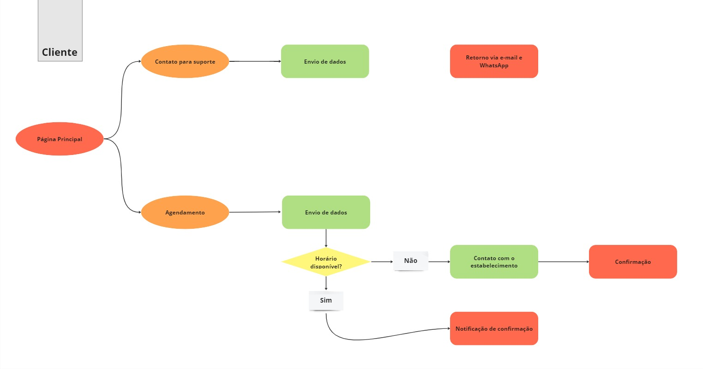

 

> **Representação Visual do User Flow**

* **🟠Laranja:** Ações pertinentes ao cliente
* **🟢Verde:** Ações pertinentes ao estabelecimento
* **🟡Amarelo:** Decisão

 

## Protótipo de Baixa Fidelidade

Estas telas fazem parte de um sistema projetado para oferecer aos usuários uma experiência aprimorada e mais versátil ao agendar os serviços de banho e tosa oferecidos pelo estabelecimento.

## Página do Cliente

Essa será a página que os clientes (dono dos pets) acessarão para interarigem com o estabelecimento e será formada pelos seguintes componentes:

<h3> Tela principal </h3>

Na tela principal são apresentado uma estrutura organizada, com seções distintas para os serviços oferecidos, um breve resumo sobre a empresa, imagens dos pets atendidos, depoimentos de clientes atendidos e um formulário de contato com o suporte para assuntos que não terão haver com com o agendamento de banho e tosa;

 

 

<h3> Barra de Navegação </h3>

Há uma barra de navegação disposta ao topo esquerdo da página para facilitar a exploração do conteúdo e proporcionar uma navegação mais intuitiva ao usuário.

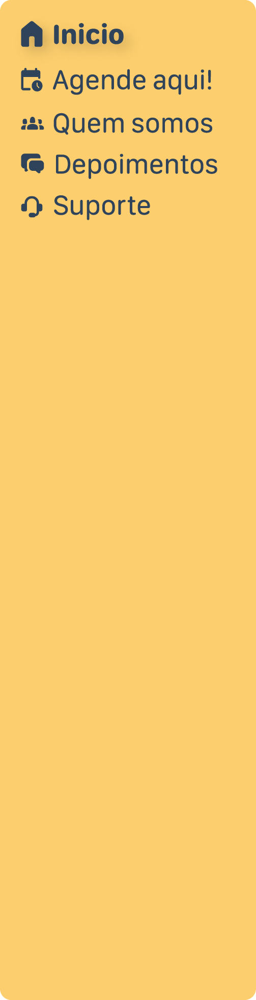

 

 

<h3> Seção de Contato com o Suporte </h3>

Na seção de Contato com a Equipe de Suporte é mostrado um formulário simples com campos para nome, e-mail, telefone e mensagem. Podendo assim ser feito um retorno ao usuário via e-mail ou WhatsApp. O layout é limpo e direto, incentivando os usuários a entrar em contato de maneira rápida e fácil.

 

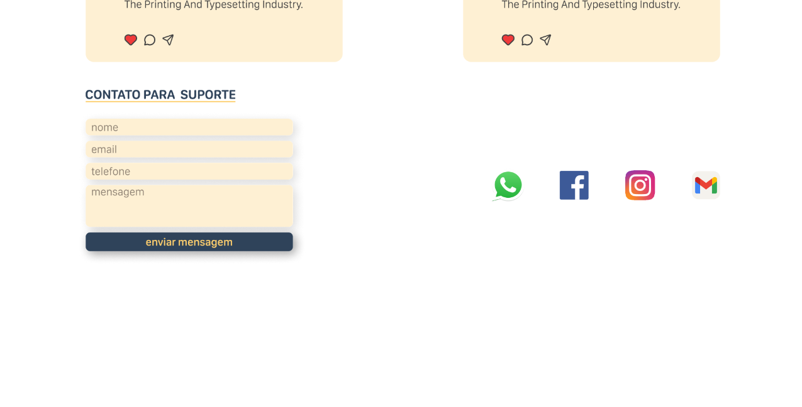

 

 

<h3>Tela de Agendamento / Requisição</h3>

No Agendamento de Serviço é exibido um formulário claro e intuitivo, dividido em seções para informações do usuário e do pet, seleção de serviço e escolha de horário. Os campos são organizados de forma lógica e fácil de preencher.

*Versão web*
 
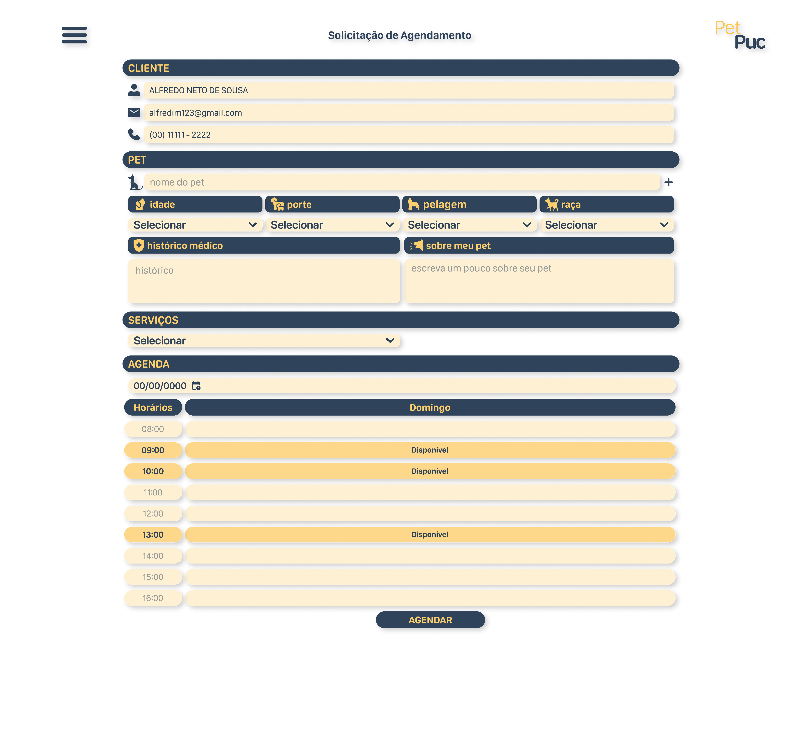
 
*Versão Mobile*
 
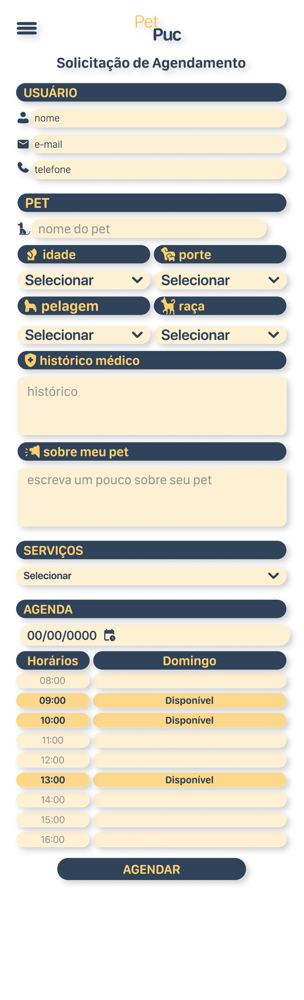

 
 

## Página do Atendente/Banhista

Essa página será acessada pelos colaboradores que terão o contato diretamente com os clientes, seja por solicitações através do site (web e mobile), ou mesmo por telefone, pessoalmente ou por wathsapp;

 

<h3> Tela de Login no Sistema </h3>

Nessa tela o colaborador deverá entrar com seu login e senha criada junto ao gestor:

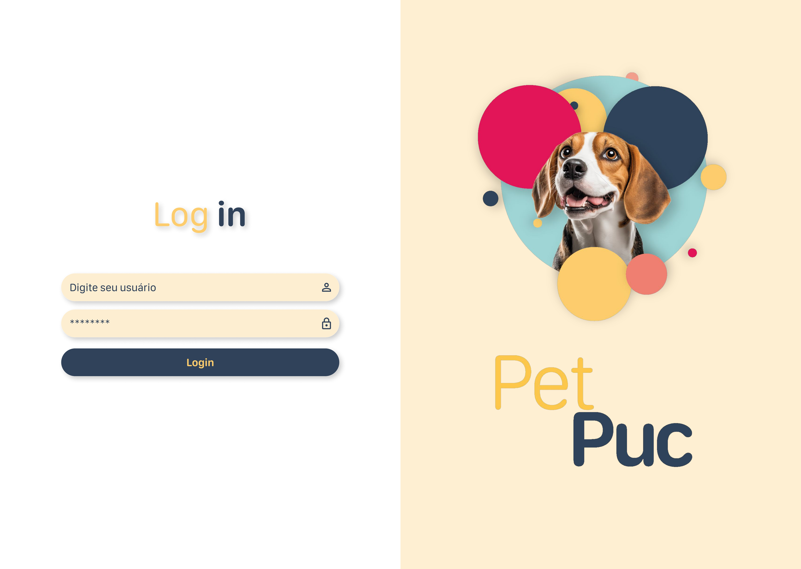

 
 

<h3> Tela Inserir Agendamentos </h3>

Nessa tela o colaborador conseguirá inserir um agendamento solicitado pelo cliente que entrar em contato via telefone ou wathsapp:

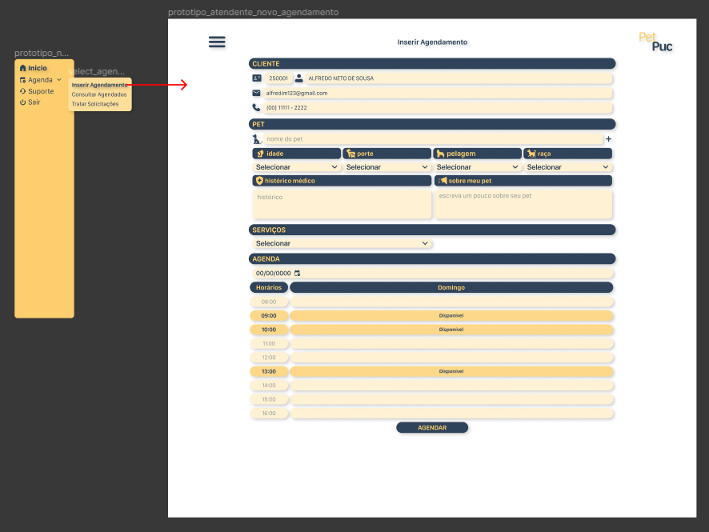

 
 

<h3> Tela Consulta Agendados </h3>

Nessa tela o Colaborador conseguirá consultar todos os agendamentos feitos, bem como alterá-los e excluí-los:

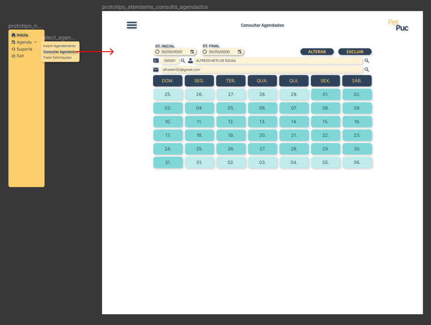

 
 

<h3> Tela Tratar Solicitações </h3>

Nessa tela o Colaborador conseguirá acessar todas as solicitações de agendamento feitas pelos clientes via site (web ou mobile) e deverá fazer o tratamento aceitando-as, alterando-as ou excluindo-as;

 

Essa é a tela mais importante para esse colaborador e seu tratamento rápido garantirá toda a eficiência percebida pelo cliente:

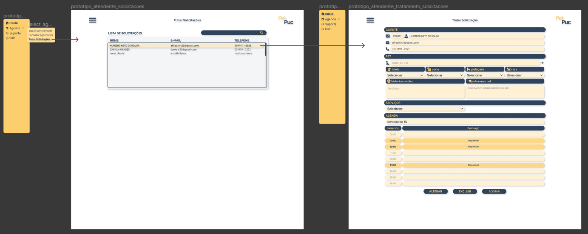

 
 

<h3> Tela Suporte </h3>

Nessa tela o colaborador conseguirá acessar todas as solicitações de suporte (assuntos que não tem haver com agendamento de serviços) feitas pelos clientes via site (web ou mobile) e deverá fazer o tratamento respondendo-as:

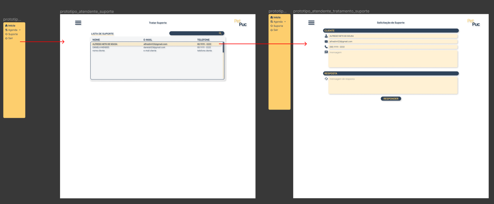

 

 
 

## Página do Gestor

Essa será a página do gestor do estabelecimento. Nela serão encontradas todas as funcionalidades da página do Atendente/Banhista, mais as funções de Cadastro de clientes, colaboradores e serviços, além da geração de relatórios de gestão; conforme detalhamento abaixo:

 

<h3> Tela de Login no Sistema </h3>

Nessa tela o gestor deverá entrar com seu login e senha criada junto ao administrador do sistema:

 
 

<h3> Tela Inserir Agendamentos </h3>

Nessa tela o gestor conseguirá inserir um agendamento solicitado pelo cliente que entrar em contato via telefone ou wathsapp:

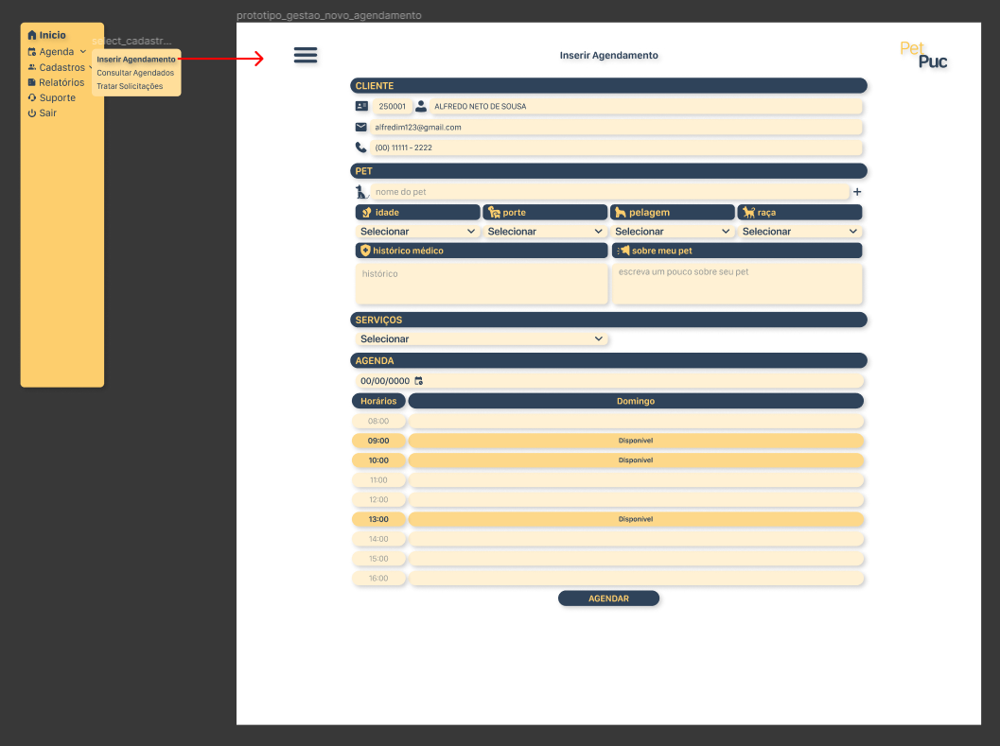

 
 

<h3> Tela Consulta Agendados </h3>

Nessa tela o gestor conseguirá consultar todos os agendamentos feitos, bem como alterá-los e excluí-los:

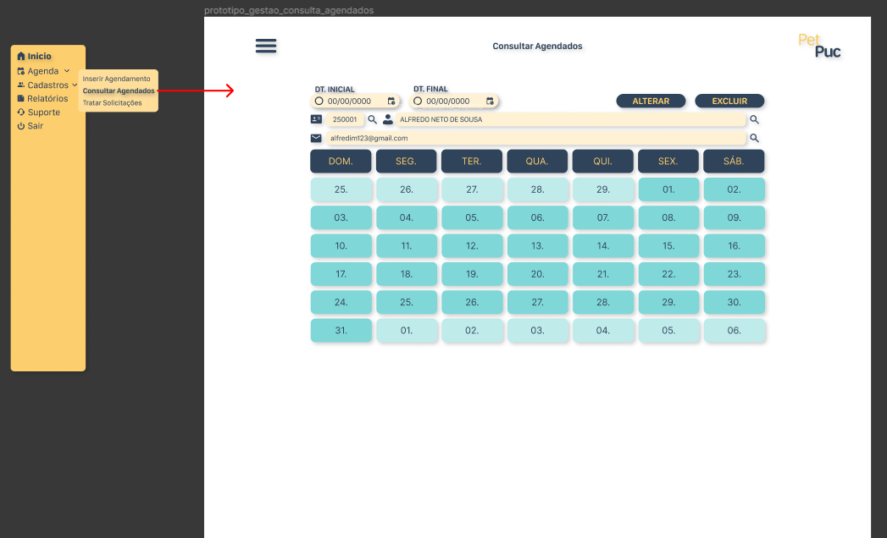

 
 

<h3> Tela Tratar Solicitações </h3>

Nessa tela o gestor conseguirá acessar todas as solicitações de agendamento feitas pelos clientes via site (web ou mobile) e deverá fazer o tratamento aceitando-as, alterando-as ou excluindo-as:

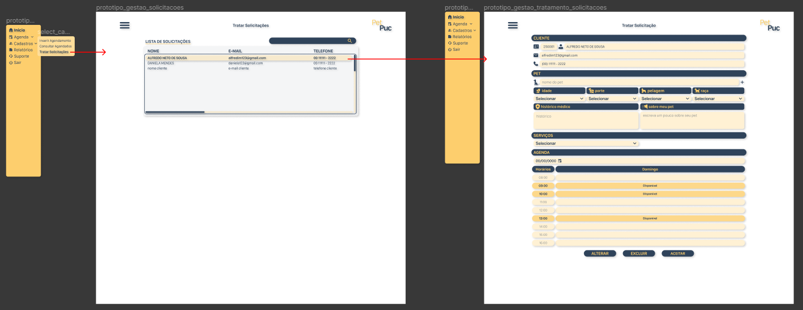

 
 

<h3> Tela Cadastro - Clientes </h3>

Nessa tela o gestor conseguirá acessar o cadastro dos clientes, criar o cadastro de um novo cliente, alterar o cadastro de um cliente já existente, bem como excluí-lo:

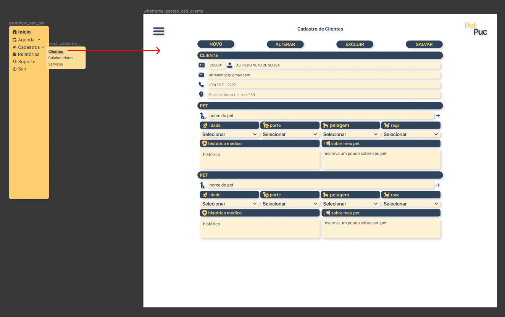

 
 

<h3> Tela Cadastro - Colaboradores </h3>

Nessa tela o gestor conseguirá acessar o cadastro dos colaboradores, criar o cadastro de um novo colaborador, alterar o cadastro de um colaborador já existente, bem como excluí-lo:

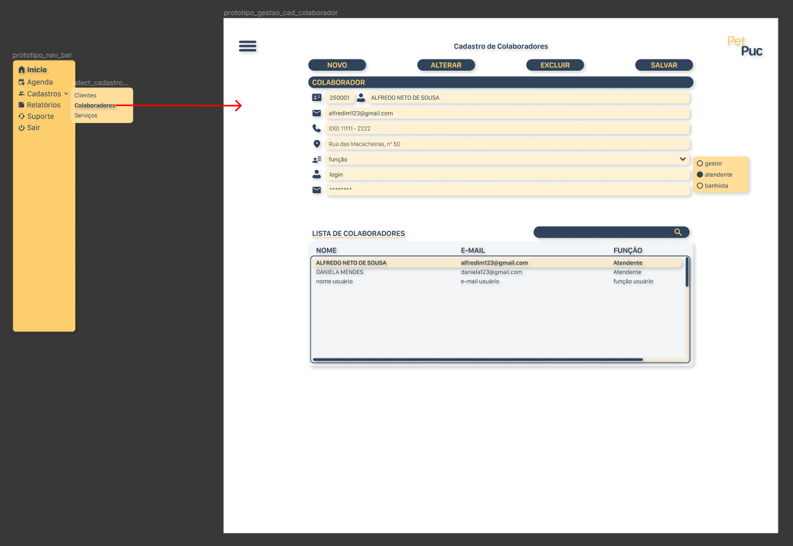

 
 

<h3> Tela Cadastro - Serviços </h3>

Nessa tela o gestor conseguirá acessar os serviços cadastrados para serem ofertados aos clientes, cadastrar um novo serviço, alterar o cadastro de um serviço, bem como excluí-lo:

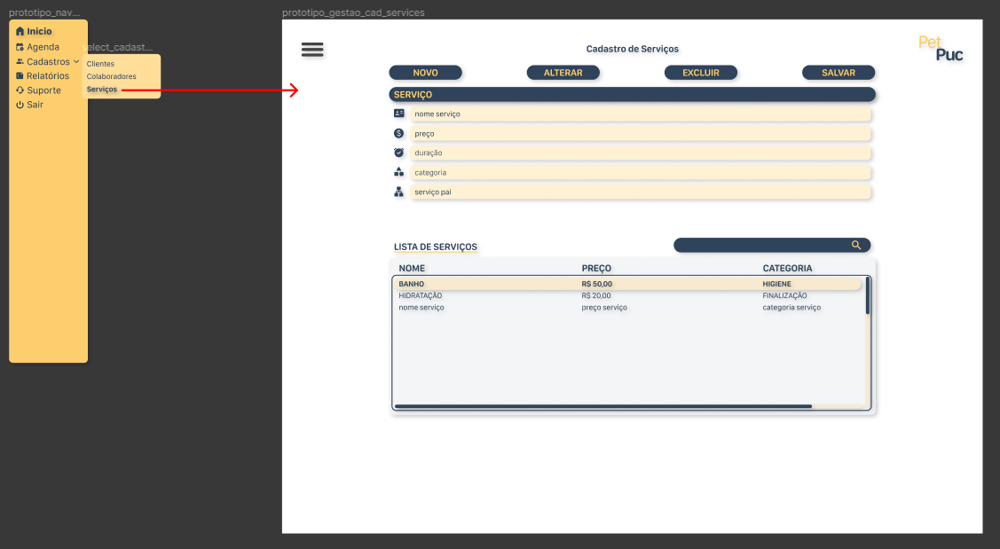

 
 

<h3> Tela Relatórios </h3>

Nessa tela o gestor conseguirá ter acesso a um dashboard, que poderá ser filtrado por período, com as informações de "Total de Agendamentos Solicitados", "Total de serviços agendados", "Total de Serviços Executados" e "Total de Serviços Cancelados". Esses cards serão clicáveis e ao serem acionados, exibirão no painel abaixo todos os dados dos clientes correspondentes a esses filtros, que poderão ser baixdos em .CSV.

 

No topo dessa página o gestor terá acesso ainda a um card clicável que retornará a base total de clientes do estabelecimento, que também poderá ser baixada em .CSV.

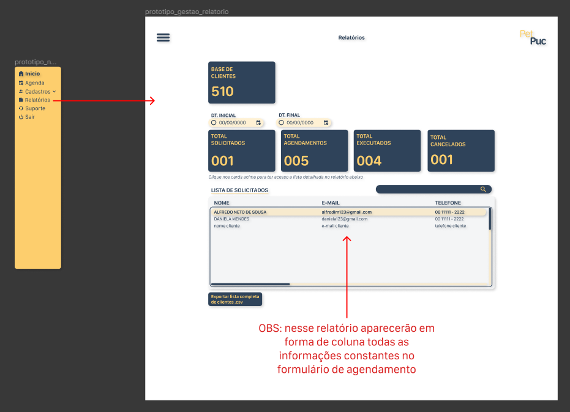

 
 

<h3> Tela Suporte </h3>

Nessa tela o gestor conseguirá acessar todas as solicitações de suporte (assuntos que não tem haver com agendamento de serviços) feitas pelos clientes via site (web ou mobile) e deverá fazer o tratamento respondendo-as:

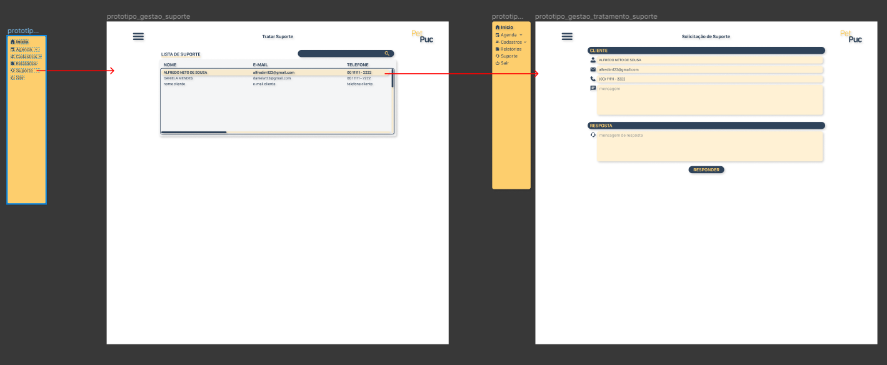

 

 
 

