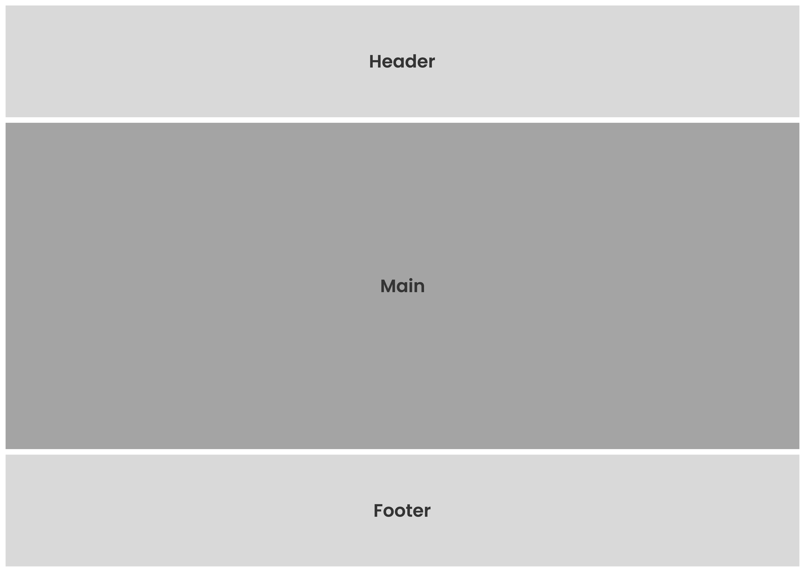

# Template padrão da aplicação

O sistema de gestão para pet shops possui um template focado na identidade visual e responsividade, garantindo 
consistência e uma experiência agradável em todos os dispositivos. O layout é composto por três seções: cabeçalho 
(header), conteúdo principal(main) e rodapé(footer). O template padrão da aplicação é apresentado de acordo com os 
protótipos 
previamente disponibilizados.

### Header
O cabeçalho inclui o logotipo da empresa, um pequeno texto inspirador e um botão que abre um menu de navegação para facilitar a exploração do conteúdo.

 
 

### Main
No centro da página que está designada ao conteúdo principal está disponível uma área dedicada aos serviços oferecidos, 
com 
botões de fácil acesso para o agendamento dos mesmos. Há 
também uma seção informativa sobre a empresa, acompanhada por uma foto do time. Além disso, uma área destinada aos depoimentos dos clientes já atendidos, oferecendo uma perspectiva autêntica sobre a experiência com a empresa.

 
 

### Footer
Na parte inferior da página, é disposto uma seção onde os usuários podem inserir seus dados para tirar dúvidas ou 
discutir outros assuntos. Além disso, estão os ícones das redes sociais da empresa, permitindo que os 
visitantes se conectem facilmente através dessas plataformas.

 
 

[//]: # ([Apresente a estrutura padrão da sua aplicação.])

[//]: # ()
[//]: # (> **Links Úteis**:)

[//]: # (>)

[//]: # (> - [CSS Website Layout &#40;W3Schools&#41;]&#40;https://www.w3schools.com/css/css_website_layout.asp&#41;)

[//]: # (> - [Website Page Layouts]&#40;http://www.cellbiol.com/bioinformatics_web_development/chapter-3-your-first-web-page-learning-html-and-css/website-page-layouts/&#41;)

[//]: # (> - [Perfect Liquid Layout]&#40;https://matthewjamestaylor.com/perfect-liquid-layouts&#41;)

[//]: # (> - [How and Why Icons Improve Your Web Design]&#40;https://usabilla.com/blog/how-and-why-icons-improve-you-web-design/&#41;)
