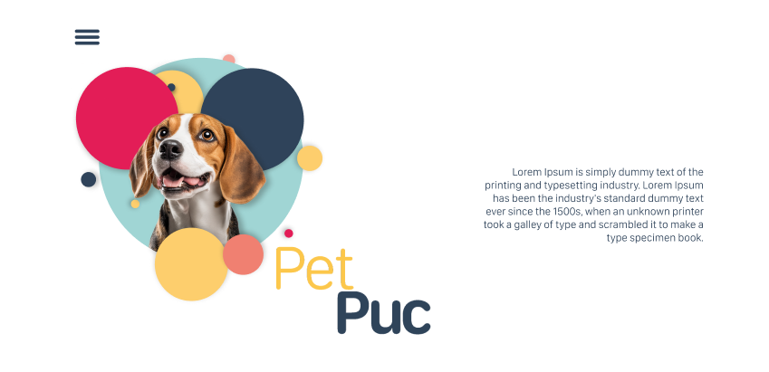
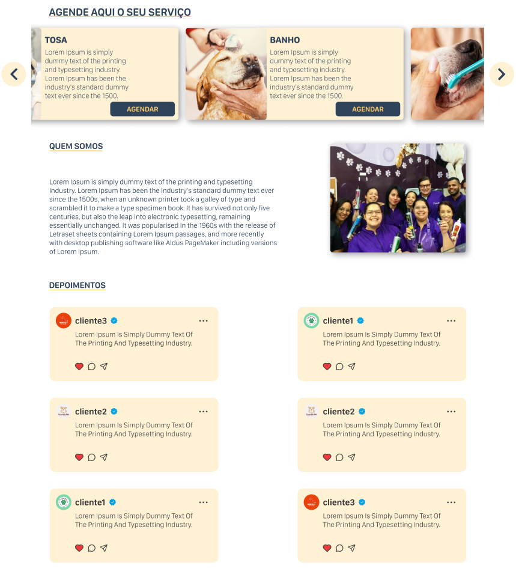
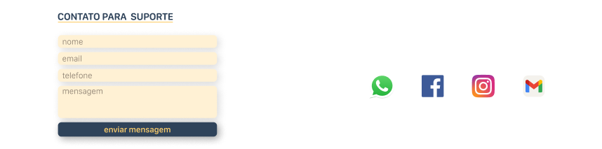

# Template padrão da aplicação

O sistema de gestão para pet shops possui um template focado na identidade visual e responsividade, garantindo 
consistência e uma experiência agradável em todos os dispositivos. 

Utilizamos as linguagens de marcação HTML e CSS para a construção dos layout e a linguagem de programação JavaScript foi utilizada para o envio e armazenamento dos dados preenchidos nos formulários e recuperação destes nas telas de tratamento, dashboards e listas de dados;

Teremos os seguintes templates padrões divididas entre as diversas páginas do projeto:

# Página Inicial

A página inicial terá como elementos padrões o menu de navegação, o header e o footer;

Utilizamos as linguagens HTML e CSS para a contrução do layout, e a linguagem JavaScript para o armazenamento dos dados enviados, através dos formulários, em localStorage e recuperação destes nas telas de tratamento das solicitações, bem como dashboards e listas de dados;

Na página inícial utilizamos os seguintes elementos visuais:

<ul>
<li>Cor do background do Body: RGB: #f6f9ff;</li>
<li>Cor do background dos cards de agendamento e campos do formulário: RGB: #FDCE6D4D;</li>
<li>Cor geral do texto do Body : RGB: #2F435A;</li>
<li>Cor do texto dos titulos dos cards de agendamento e depoimentos: RGB: #11979C;</li>
<li>Cor do background dos botões: linear-gradient(to right, #2F435A, #8195ac)</li>
<li>Font-family: Arial, Helvetica, sans-serif;</li>
<li>Font-size: Padrão do CSS. </li>
</ul>

### Header
O cabeçalho inclui o logotipo da empresa, um pequeno texto inspirador e um botão que abre um menu de navegação para facilitar a exploração do conteúdo.

 
 

### Main
No centro da página que está designada ao conteúdo principal está disponível uma área dedicada aos serviços oferecidos, 
com 
botões de fácil acesso para o agendamento dos mesmos. Há 
também uma seção informativa sobre a empresa, acompanhada por uma foto do time. Além disso, uma área destinada aos depoimentos dos clientes já atendidos, oferecendo uma perspectiva autêntica sobre a experiência com a empresa.

 
 

### Footer
Na parte inferior da página, é disposto uma seção onde os usuários podem inserir seus dados para tirar dúvidas ou 
discutir outros assuntos. Além disso, estão os ícones das redes sociais da empresa, permitindo que os 
visitantes se conectem facilmente através dessas plataformas.

 
 

[//]: # ([Apresente a estrutura padrão da sua aplicação.])

[//]: # ()
[//]: # (> **Links Úteis**:)

[//]: # (>)

[//]: # (> - [CSS Website Layout &#40;W3Schools&#41;]&#40;https://www.w3schools.com/css/css_website_layout.asp&#41;)

[//]: # (> - [Website Page Layouts]&#40;http://www.cellbiol.com/bioinformatics_web_development/chapter-3-your-first-web-page-learning-html-and-css/website-page-layouts/&#41;)

[//]: # (> - [Perfect Liquid Layout]&#40;https://matthewjamestaylor.com/perfect-liquid-layouts&#41;)

[//]: # (> - [How and Why Icons Improve Your Web Design]&#40;https://usabilla.com/blog/how-and-why-icons-improve-you-web-design/&#41;)
