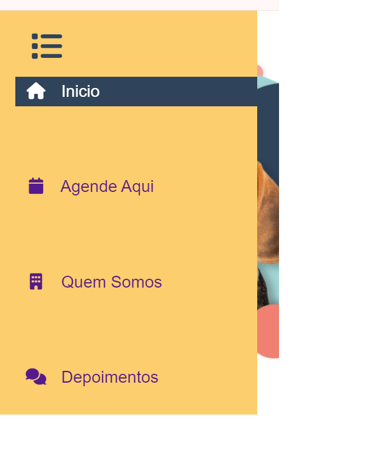
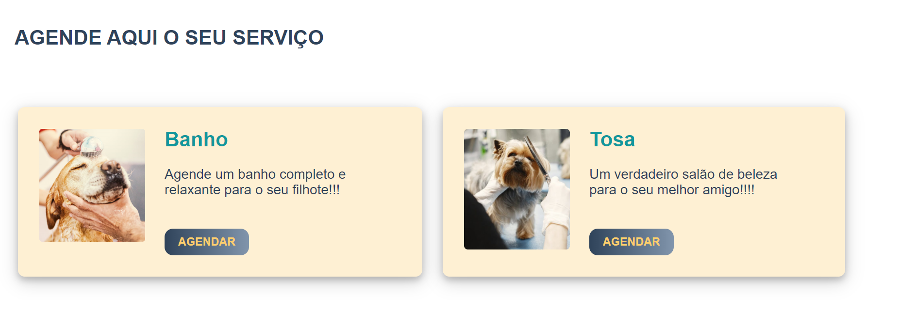

# Template padrão da aplicação

O sistema de gestão para pet shops possui um template focado na identidade visual e responsividade, garantindo 
consistência e uma experiência agradável em todos os dispositivos. 

Utilizamos as linguagens HTML e CSS para a contrução do layout, e a linguagem JavaScript para o armazenamento dos dados enviados, através de formulários, em localStorage e recuperação destes nas telas de tratamento das solicitações, bem como dashboards e listas de dados;

O código utilizado para a construção dos elementos citados, estão disponíveis <a href="https://github.com/ICEI-PUC-Minas-PMV-ADS/pmv-ads-2024-1-e1-proj-web-t6-pmv-ads-2024-1-e1-projeto_gpetshop/tree/main/codigo-fonte">aqui</a>, as imagens <a href="https://github.com/ICEI-PUC-Minas-PMV-ADS/pmv-ads-2024-1-e1-proj-web-t6-pmv-ads-2024-1-e1-projeto_gpetshop/tree/main/documentos/img">aqui</a> e ícones utilizados no projeto estão disponíveis <a href="https://cdnjs.cloudflare.com/ajax/libs/font-awesome/6.5.2/css/all.min.css">aqui</a>;

Utilizamos os seguintes elementos visuais:

<ul>
<li>Cor do background do Body: RGB: #f6f9ff;</li>
<li>Cor do background da barra de navegação lateral: RGB: #FDCE6D </li>
<li>Cor do texto e do background da barra de navegação lateral em efeito hover: RGB:  color:#fff; background-color: #2F435A; </li>  
<li>Cor do background dos cards de agendamento e campos do formulário: RGB: #FDCE6D4D;</li>
<li>Cor geral do texto do Body : RGB: #2F435A;</li>
<li>Cor do texto dos titulos dos cards de agendamento e depoimentos: RGB: #11979C;</li>
<li>Cor do background dos botões: linear-gradient(to right, #2F435A, #8195ac)</li>
<li>Font-family: Arial, Helvetica, sans-serif;</li>
<li>Font-size: Padrão do CSS. </li>
</ul>

Nossa aplicação contará com as seguintes funcionalidades:

<ul>
<li>Página inicial</li>
<li>Formulário</li>
<li>Tela de login (para colaboradores)</li>
<li>Lista de exibição com elementos clicáveis</li>
<li>Dashboard com informações do banco de dados (localStorage)</li>
<li>Agenda em formato de calendário com os agendamentos em formato de eventos</li>
</ul>

 

Abaixo temos a apresentação visual dos templates padrões dessas funcionalidades:

 

## Página Inicial

A página inicial terá como elementos padrões o menu de navegação lateral (oculto), o header, o main e o footer;

### Header

#### - Logo e informações da empresa

O cabeçalho inclui o logotipo da empresa, um pequeno texto com o endereço e telefone de contato da empresa, além do icone da barra de navegação lateral que está oculta;

 
 

### Menu de navegação

#### - Barra de navegação lateral oculta

Todas as páginas da aplicação contarão com essa barra de navegação lateral que ficará oculta, aparecendo somente o ícone clicável de menu na parte superior da página.

### Main
No Main da página temos as seguintes sessões:

#### - Sessão de Agendamento

Compostas por dois cards com uma breve descrição dos serviços oferecidos e um botão que leva o usuário à página de solicitação de serviços, nesse caso banho e tosa;

 

#### - Sessão de Apresentação institucional

Uma sessão dedicada a apresentar a empresa, sua missão e seus valores, além de uma foto amigável de todo o time;

 

####  - Sessão depoimentos

Nessa sessão trazemos depoimentos de clientes sobre suas experiências na utilização de nossos serviços:

 

### Footer

No footer da página encontramos as seguintes sessões:

#### - Contato com o Suporte e link para Redes Sociais

No lado esquerdo temos um formulário que é destinado a assuntos que os usuários precisem resolver com a empresa além da solicitação de serviços; ex.: pedido de alterações, dúvidas, esclarecimentos, reclamações, dentre outros assuntos;

Já no lado direito do footer temos os ícones com os links e um convite aos usuários para visitarem nossas redes sociais;

 
 

[//]: # ([Apresente a estrutura padrão da sua aplicação.])

[//]: # ()
[//]: # (> **Links Úteis**:)

[//]: # (>)

[//]: # (> - [CSS Website Layout &#40;W3Schools&#41;]&#40;https://www.w3schools.com/css/css_website_layout.asp&#41;)

[//]: # (> - [Website Page Layouts]&#40;http://www.cellbiol.com/bioinformatics_web_development/chapter-3-your-first-web-page-learning-html-and-css/website-page-layouts/&#41;)

[//]: # (> - [Perfect Liquid Layout]&#40;https://matthewjamestaylor.com/perfect-liquid-layouts&#41;)

[//]: # (> - [How and Why Icons Improve Your Web Design]&#40;https://usabilla.com/blog/how-and-why-icons-improve-you-web-design/&#41;)
