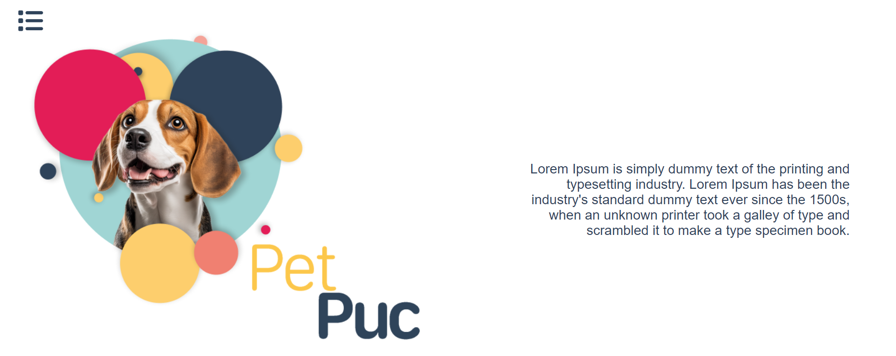
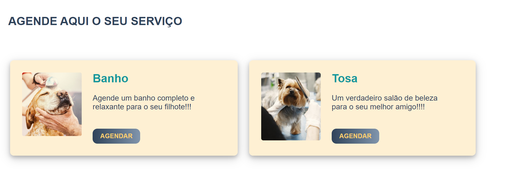
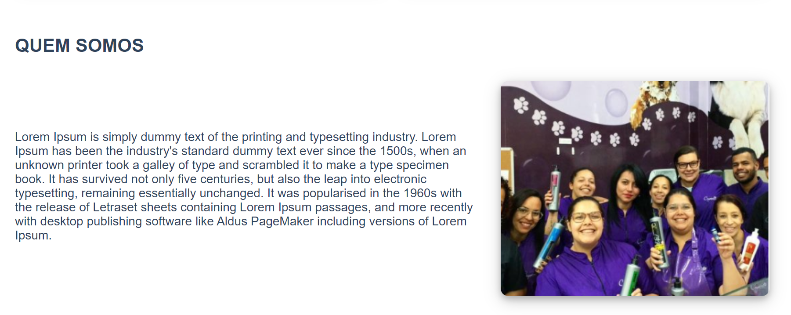
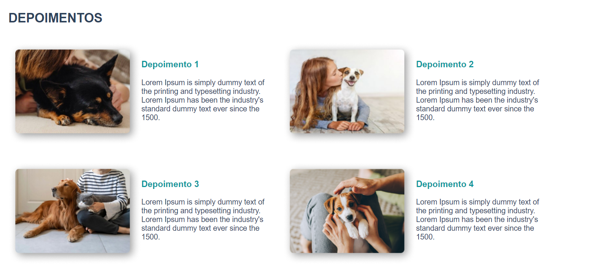
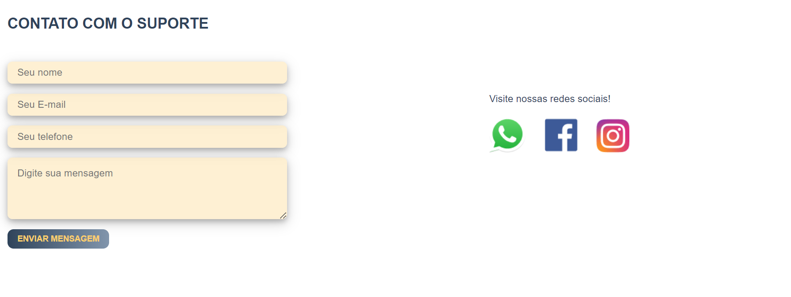
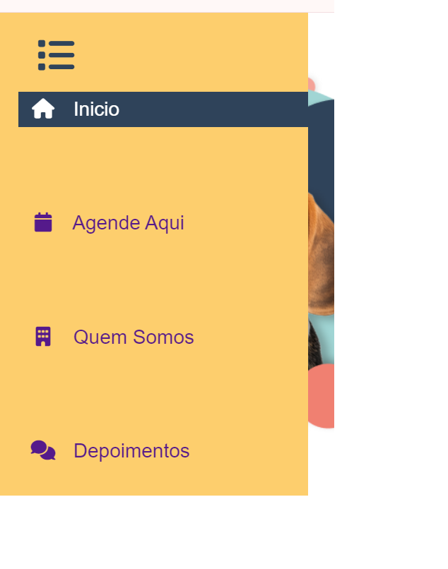

# Programação de Funcionalidades

Abaixo estão as funcionalidades implementadas de acordo com os requisitos funcionais apresentados na <a href="https://github.com/ICEI-PUC-Minas-PMV-ADS/pmv-ads-2024-1-e1-proj-web-t6-pmv-ads-2024-1-e1-projeto_gpetshop/blob/main/documentos/02-Especifica%C3%A7%C3%A3o%20do%20Projeto.md">Especificação do projeto</a>;

## Página Inicial
 

 
Barra de navegação lateral oculta:
 

#### Requisito atendido

RF-001: Página inicial.

A aplicação deve contar com uma página inicial que permita informar aos clientes os serviços oferecidos, apresentar a empresa e compartilhar depoimentos de outros clientes sobre a percepção dos serviços utilizados, além se servir como ponto de partida para as solicitações desses clientes;

#### Artefatos da funcionalidade

<li>
  index.html
</li>
<li>
  index.css
</li>
<li>
  index.js
</li>

#### Estrutura de Dados

<li>
  <a href="https://github.com/ICEI-PUC-Minas-PMV-ADS/pmv-ads-2024-1-e1-proj-web-t6-pmv-ads-2024-1-e1-projeto_gpetshop/blob/main/codigo-fonte/src/paginaInicial/index.html">index.html</a>
</li>
<li>
  <a href="https://github.com/ICEI-PUC-Minas-PMV-ADS/pmv-ads-2024-1-e1-proj-web-t6-pmv-ads-2024-1-e1-projeto_gpetshop/blob/main/codigo-fonte/src/paginaInicial/index.css">index.css</a>
</li>
<li>
 <a href="https://github.com/ICEI-PUC-Minas-PMV-ADS/pmv-ads-2024-1-e1-proj-web-t6-pmv-ads-2024-1-e1-projeto_gpetshop/blob/main/codigo-fonte/src/paginaInicial/index.js">index.js</a>
</li>

#### Instruções de acesso

Abra um navegador de Internet e informe a seguinte URL:

#### Responsável

João Henrique Andrade Leite

 
 

## Solicitação de Suporte
 

#### Requisito atendido

RF-004: Solicitação de Suporte.

O sistema deve permitir que o cliente consiga interagir com a empresa para assuntos que não tenham a ver diretamente com agendamento de serviços, através de um formulário de suporte que deverá constar na página inicial do site;

#### Artefatos da funcionalidade

<li>
  index.html
</li>
<li>
  index.css
</li>
<li>
  index.js
</li>

#### Estrutura de Dados

<li>
  <a href="https://github.com/ICEI-PUC-Minas-PMV-ADS/pmv-ads-2024-1-e1-proj-web-t6-pmv-ads-2024-1-e1-projeto_gpetshop/blob/main/codigo-fonte/src/paginaInicial/index.html">index.html</a>
</li>
<li>
  <a href="https://github.com/ICEI-PUC-Minas-PMV-ADS/pmv-ads-2024-1-e1-proj-web-t6-pmv-ads-2024-1-e1-projeto_gpetshop/blob/main/codigo-fonte/src/paginaInicial/index.css">index.css</a>
</li>
<li>
 <a href="https://github.com/ICEI-PUC-Minas-PMV-ADS/pmv-ads-2024-1-e1-proj-web-t6-pmv-ads-2024-1-e1-projeto_gpetshop/blob/main/codigo-fonte/src/paginaInicial/index.js">index.js</a>
</li>

#### Instruções de acesso

Abra um navegador de Internet e informe a seguinte URL:

#### Responsável

João Henrique Andrade Leite

 

## Tela de Agendamento de Serviço pelo colaborador  (RF-03)

O acesso a tela de cadastro poderá ser feito através da opção de menu “Cadastre-se”. As estruturas de dados foram baseadas em HTML, CSS e JS.

Exemplo da tela de agendamento:

### Requisito Atendido

RF-03: O sistema deve possibilitar o cadastramento de uma solicitação de serviços para clientes que ligarem e/ou 
chegarem presencialmente na loja sem avisar.

### Artefatos da funcionalidade

novoAgendamentoColab.html

novoAgendamentoColab.css

novoAgendamentoColab.js

 

### Estrutura de Dados
<code> // Ainda não desenvolvido a estrutura de dados desta página.</code>

 

### Instruções de acesso

 

### Responsável

Paulo Henrique Sousa Carvalho

 

## Tela de Cadastro de Usuários Colaboradores  (RF-09)

O acesso a tela de cadastro poderá ser feito através da opção de menu “Cadastre-se”  em seguida " Clientes". As estruturas de dados foram baseadas em HTML, CSS e JS.

Exemplo da tela de agendamento:

Adcionar imagem

### Requisito Atendido

RF-09: O Sistema deve possibilitar o gestor cadastrar, alterar e excluir os acessos dos colaboradores, com informações pessoais e criação de login e senha.

### Artefatos da funcionalidade

cadastrodeclientes.html

cadastrodeclientes.css

cadastrodeclientes.js

 

### Estrutura de Dados
<li>
  <a href="https://github.com/ICEI-PUC-Minas-PMV-ADS/pmv-ads-2024-1-e1-proj-web-t6-pmv-ads-2024-1-e1-projeto_gpetshop/blob/main/codigo-fonte/src/cadastrodeclientes/index.html">index.html</a>
</li>
<li>
  <a href="https://github.com/ICEI-PUC-Minas-PMV-ADS/pmv-ads-2024-1-e1-proj-web-t6-pmv-ads-2024-1-e1-projeto_gpetshop/blob/main/codigo-fonte/src/cadastrodeclientes/index.css">index.css</a>
</li>
<li>
 <a href="https://github.com/ICEI-PUC-Minas-PMV-ADS/pmv-ads-2024-1-e1-proj-web-t6-pmv-ads-2024-1-e1-projeto_gpetshop/blob/main/codigo-fonte/src/cadastrodecliente/index.js">index.js</a>
</li>

 

### Instruções de acesso

Abra um navegador de Internet e informe a seguinte URL:

### Responsável

Felipe Costa Moreira 

<!--
> **Links Úteis**:
> - [Trabalhando com HTML5 Local Storage e JSON](https://www.devmedia.com.br/trabalhando-com-html5-local-storage-e-json/29045)
> - [JSON Tutorial](https://www.w3resource.com/JSON)
> - [JSON - Introduction (W3Schools)](https://www.w3schools.com/js/js_json_intro.asp)
> - [JSON Tutorial (TutorialsPoint)](https://www.tutorialspoint.com/json/index.htm)
-->
