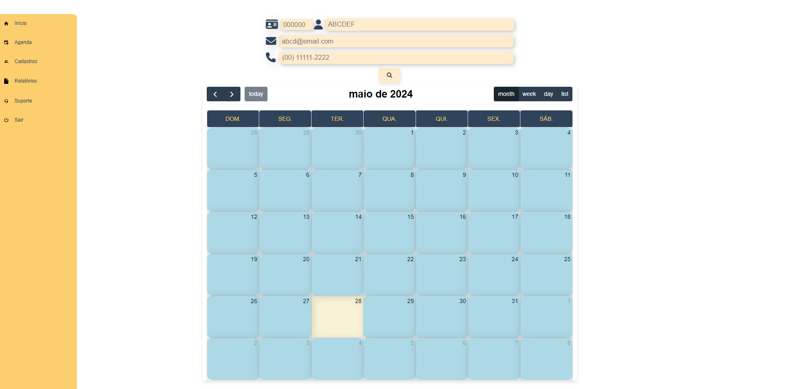

# Programação de Funcionalidades

Abaixo estão as funcionalidades implementadas de acordo com os requisitos funcionais apresentados
na <a href="https://github.com/ICEI-PUC-Minas-PMV-ADS/pmv-ads-2024-1-e1-proj-web-t6-pmv-ads-2024-1-e1-projeto_gpetshop/blob/main/documentos/02-Especifica%C3%A7%C3%A3o%20do%20Projeto.md">
Especificação do projeto</a>;

## Página Inicial

 

 
Barra de navegação lateral oculta:
 

#### Requisito atendido

RF-001: Página inicial.

A aplicação deve contar com uma página inicial que permita informar aos clientes os serviços oferecidos, apresentar a
empresa e compartilhar depoimentos de outros clientes sobre a percepção dos serviços utilizados, além se servir como
ponto de partida para as solicitações desses clientes;

#### Artefatos da funcionalidade

<li>
  index.html
</li>
<li>
  index.css
</li>
<li>
  index.js
</li>

#### Estrutura de Dados

<li>
  <a href="https://github.com/ICEI-PUC-Minas-PMV-ADS/pmv-ads-2024-1-e1-proj-web-t6-pmv-ads-2024-1-e1-projeto_gpetshop/blob/main/codigo-fonte/src/paginaInicial/index.html">index.html</a>
</li>
<li>
  <a href="https://github.com/ICEI-PUC-Minas-PMV-ADS/pmv-ads-2024-1-e1-proj-web-t6-pmv-ads-2024-1-e1-projeto_gpetshop/blob/main/codigo-fonte/src/paginaInicial/index.css">index.css</a>
</li>
<li>
 <a href="https://github.com/ICEI-PUC-Minas-PMV-ADS/pmv-ads-2024-1-e1-proj-web-t6-pmv-ads-2024-1-e1-projeto_gpetshop/blob/main/codigo-fonte/src/paginaInicial/index.js">index.js</a>
</li>

#### Instruções de acesso

Abra um navegador de Internet e informe a seguinte URL:

#### Responsável

João Henrique Andrade Leite

 
 

## Solicitação de agendamento

 

## Solicitação de Suporte

 

#### Requisito atendido

RF-004: Solicitação de Suporte.

O sistema deve permitir que o cliente consiga interagir com a empresa para assuntos que não tenham a ver diretamente com
agendamento de serviços, através de um formulário de suporte que deverá constar na página inicial do site;

#### Artefatos da funcionalidade

<li>
  index.html
</li>
<li>
  index.css
</li>
<li>
  index.js
</li>

#### Estrutura de Dados

<li>
  <a href="https://github.com/ICEI-PUC-Minas-PMV-ADS/pmv-ads-2024-1-e1-proj-web-t6-pmv-ads-2024-1-e1-projeto_gpetshop/blob/main/codigo-fonte/src/paginaInicial/index.html">index.html</a>
</li>
<li>
  <a href="https://github.com/ICEI-PUC-Minas-PMV-ADS/pmv-ads-2024-1-e1-proj-web-t6-pmv-ads-2024-1-e1-projeto_gpetshop/blob/main/codigo-fonte/src/paginaInicial/index.css">index.css</a>
</li>
<li>
 <a href="https://github.com/ICEI-PUC-Minas-PMV-ADS/pmv-ads-2024-1-e1-proj-web-t6-pmv-ads-2024-1-e1-projeto_gpetshop/blob/main/codigo-fonte/src/paginaInicial/index.js">index.js</a>
</li>

#### Instruções de acesso

Abra um navegador de Internet e informe a seguinte URL:

#### Responsável

João Henrique Andrade Leite

 

## Tela de Agendamento de Serviço pelo colaborador  (RF-03)

O acesso a tela de Novo Agendamento poderá ser feito através do menu lateral em “Agenda”, clicando na sub-opção
“Inserir Agendamento”. O desenvolvimento deste requisito foi baseado em HTML, CSS e JS.

#### Exemplo da tela de Novo Agendamento:

### Requisito Atendido

RF-03: O sistema deve possibilitar o cadastramento de uma solicitação de serviços para clientes que ligarem e/ou
chegarem presencialmente na loja sem avisar.

### Artefatos da funcionalidade

NovoAgendamento.html 
  NovoAgendamento.css
  actionsNovoAgendamento.js
  bd_operationsNovoAgendamento.js
  bdNovoAgendamento.js
 

### Estrutura de Dados

<a href="https://github.com/ICEI-PUC-Minas-PMV-ADS/pmv-ads-2024-1-e1-proj-web-t6-pmv-ads-2024-1-e1-projeto_gpetshop/blob/main/codigo-fonte/src/NovoAgendamento/NovoAgendamento.html">
NovoAgendamento.html</a>
 
<a href="https://github.com/ICEI-PUC-Minas-PMV-ADS/pmv-ads-2024-1-e1-proj-web-t6-pmv-ads-2024-1-e1-projeto_gpetshop/blob/main/codigo-fonte/src/NovoAgendamento/css/NovoAgendamento.css">
NovoAgendamento.css</a>
 
<a href="https://github.com/ICEI-PUC-Minas-PMV-ADS/pmv-ads-2024-1-e1-proj-web-t6-pmv-ads-2024-1-e1-projeto_gpetshop
/blob/main/codigo-fonte/src/NovoAgendamento/js/actionsNovoAgendamento.js">
actionsNovoAgendamento.js</a>
 
<a href="https://github.com/ICEI-PUC-Minas-PMV-ADS/pmv-ads-2024-1-e1-proj-web-t6-pmv-ads-2024-1-e1-projeto_gpetshop
/blob/main/codigo-fonte/src/NovoAgendamento/js/bd_operationsNovoAgendamento.js">
bd_operationsNovoAgendamento.js</a>
 
<a href="https://github.com/ICEI-PUC-Minas-PMV-ADS/pmv-ads-2024-1-e1-proj-web-t6-pmv-ads-2024-1-e1-projeto_gpetshop
/blob/main/codigo-fonte/src/NovoAgendamento/js/bdNovoAgendamento.js">
bdNovoAgendamento.js</a>

 

### Instruções de acesso

**1º Passo:** Fazer o login como **gestor** ou **atendente / banhista**;

**2º Passo:** Acessar o menu lateral que será aberto ao clicar no ícone esquerdo do cabeçalho da página;

**3º Passo:** Ir até o item **Agenda** onde abrirá um sub-menu com três opções, então basta clicar em **Inserir Agendamento**;

**4º Passo:** O usuário será levado à página de criação de novo agendamento, onde poderá inserir os dados do 
cliente e do(s) pet(s);

**5º Passo**: Clicar no botão **Agendar**, que irá criar um agendamento direto, levando o registro já para a agenda.
 

### Responsável

Paulo Henrique Sousa Carvalho

 

## Tratamento das Solicitações de Serviço (RF-05)

O acesso ao Tratamento das Solicitações de Serviços se desdobra em duas partes: a primeira é uma lista contendo as 
solicitações em aberto e a segunda é uma tela onde o usuário poderá **alterar** (se caso necessário), **excluir** a 
solicitação ou **aceitar** o agendamento.

#### Exemplo da tela de Listagem de Solicitações:

#### Exemplo da tela de Tratamento da Solicitação:

### Requisito Atendido

RF-05: A aplicação deve fornecer aos usuários colaboradores uma forma de tratar as solicitações de agendamentos 
recebidas, permitindo a confirmação, alteração ou exclusão da mesma.

### Artefatos da funcionalidade

#### <li>Listagem das Solicitações</li>
ListagemSolicitacao.html
  ListagemSolicitacao.css
  actionsListagem.js
  bd_operationsListagem.js
  bdListagem.js
 

#### <li>Tratamento da Solicitação</li>
TratamentoSolicitacao.html
  TratamentoSolicitacao.css
  actionsTratamento.js
  bd_operationsTratamento.js
  bdTratamento.js
 

### Estrutura de Dados

#### <li>Listagem das Solicitações</li>
<a href="https://github.com/ICEI-PUC-Minas-PMV-ADS/pmv-ads-2024-1-e1-proj-web-t6-pmv-ads-2024-1-e1-projeto_gpetshop/blob/main/codigo-fonte/src/ListagemSolicitacao/ListagemSolicitacao.html">
ListagemSolicitacao.html</a>
 
<a href="https://github.com/ICEI-PUC-Minas-PMV-ADS/pmv-ads-2024-1-e1-proj-web-t6-pmv-ads-2024-1-e1-projeto_gpetshop/blob/main/codigo-fonte/src/ListagemSolicitacao/css/ListagemSolicitacao.css">
ListagemSolicitacao.css</a>
 
<a href="https://github.com/ICEI-PUC-Minas-PMV-ADS/pmv-ads-2024-1-e1-proj-web-t6-pmv-ads-2024-1-e1-projeto_gpetshop
/blob/main/codigo-fonte/src/ListagemSolicitacao/js/actionsListagem.js">
actionsListagem.js</a>
 
<a href="https://github.com/ICEI-PUC-Minas-PMV-ADS/pmv-ads-2024-1-e1-proj-web-t6-pmv-ads-2024-1-e1-projeto_gpetshop
/blob/main/codigo-fonte/src/ListagemSolicitacao/js/bd_operationsListagem.js">
bd_operationsListagem.js</a>
 
<a href="https://github.com/ICEI-PUC-Minas-PMV-ADS/pmv-ads-2024-1-e1-proj-web-t6-pmv-ads-2024-1-e1-projeto_gpetshop
/blob/main/codigo-fonte/src/ListagemSolicitacao/js/bdListagem.js">
bdListagem.js</a>

 

#### <li>Tratamento da Solicitação</li>
<a href="https://github.com/ICEI-PUC-Minas-PMV-ADS/pmv-ads-2024-1-e1-proj-web-t6-pmv-ads-2024-1-e1-projeto_gpetshop/blob/main/codigo-fonte/src/TratamentoSolicitacao/TratamentoSolicitacao.html">
TratamentoSolicitacao.html</a>
 
<a href="https://github.com/ICEI-PUC-Minas-PMV-ADS/pmv-ads-2024-1-e1-proj-web-t6-pmv-ads-2024-1-e1-projeto_gpetshop/blob/main/codigo-fonte/src/TratamentoSolicitacao/css/TratamentoSolicitacao.css">
TratamentoSolicitacao.css</a>
 
<a href="https://github.com/ICEI-PUC-Minas-PMV-ADS/pmv-ads-2024-1-e1-proj-web-t6-pmv-ads-2024-1-e1-projeto_gpetshop
/blob/main/codigo-fonte/src/TratamentoSolicitacao/js/actionsTratamento.js">
actionsTratamento.js</a>
 
<a href="https://github.com/ICEI-PUC-Minas-PMV-ADS/pmv-ads-2024-1-e1-proj-web-t6-pmv-ads-2024-1-e1-projeto_gpetshop
/blob/main/codigo-fonte/src/TratamentoSolicitacao/js/bd_operationsTratamento.js">
bd_operationsTratamento.js</a>
 
<a href="https://github.com/ICEI-PUC-Minas-PMV-ADS/pmv-ads-2024-1-e1-proj-web-t6-pmv-ads-2024-1-e1-projeto_gpetshop
/blob/main/codigo-fonte/src/TratamentoSolicitacao/js/bdTratamento.js">
bdTratamento.js</a>

 

### Instruções de acesso

**1º Passo:** Fazer o login como **gestor** ou **atendente / banhista**;

**2º Passo:** Acessar o menu lateral que será aberto ao clicar no ícone esquerdo do cabeçalho da página;

**3º Passo:** Ir até o item **Agenda** onde abrirá um sub-menu com três opções, então basta clicar em **Tratar 
Solicitações**;

**4º Passo:** O usuário será levado à página de **Listagem das Solicitações** e clicando em uma das solicitações desta 
lista, o usuário será levado para a tela de **Tratamento** daquela Solicitação;

**5º Passo**: Agora ele(o usuário) poderá verificar as condições da solicitação e então decidir entre as opções de 
**Alterar**, **Excluir** ou **Aceitar** a solicitação clicando nos botões dispostos no rodapé da página;

**6º Passo**: Se por algum motivo o estabelecimento não poder aceitar, necessitar verificar alguns dados ou até 
alterar o horário de agendamento, ele deverá entrar em contato com o cliente para tais decições.
 

### Responsável

Paulo Henrique Sousa Carvalho

 

## Tratamento de solicitações de suporte (RF-06)

O acesso ao Tratamento das Solicitações de Suportw se desdobra também em duas partes: a primeira como uma lista 
contendo as
solicitações em aberto e a segunda é uma tela onde o usuário poderá **inserir** uma resposta, 
**excluir** a
solicitação ou **responder** o contato.

#### Exemplo da tela de Listagem de Mensagens:

#### Exemplo da tela de Tratamento do Suporte:

### Requisito Atendido

RF-06: O Sistema deve permitir que os colaboradores tratem as solicitações vindas do formulário de suporte 
(solicitações que não tem a ver diretamente com o agendamento de serviços).

### Artefatos da funcionalidade

#### <li>Listagem das Solicitações</li>
ListagemSuporte.html
  ListagemSuporte.css
  actionsListagem.js
  bd_operationsListagem.js
  bdListagem.js
 

#### <li>Tratamento da Solicitação</li>
TratamentoSuporte.html
  TratamentoSuporte.css
  actionsTratamento.js
  bd_operationsTratamento.js
  bdTratamento.js
 

### Estrutura de Dados

#### <li>Listagem das Solicitações</li>
<a href="https://github.com/ICEI-PUC-Minas-PMV-ADS/pmv-ads-2024-1-e1-proj-web-t6-pmv-ads-2024-1-e1-projeto_gpetshop/blob/main/codigo-fonte/src/ListagemSuporte/ListagemSuporte.html">
ListagemSuporte.html</a>
 
<a href="https://github.com/ICEI-PUC-Minas-PMV-ADS/pmv-ads-2024-1-e1-proj-web-t6-pmv-ads-2024-1-e1-projeto_gpetshop/blob/main/codigo-fonte/src/ListagemSuporte/css/ListagemSuporte.css">
ListagemSuporte.css</a>
 
<a href="https://github.com/ICEI-PUC-Minas-PMV-ADS/pmv-ads-2024-1-e1-proj-web-t6-pmv-ads-2024-1-e1-projeto_gpetshop
/blob/main/codigo-fonte/src/ListagemSuporte/js/actionsListagem.js">
actionsListagem.js</a>
 
<a href="https://github.com/ICEI-PUC-Minas-PMV-ADS/pmv-ads-2024-1-e1-proj-web-t6-pmv-ads-2024-1-e1-projeto_gpetshop
/blob/main/codigo-fonte/src/ListagemSuporte/js/bd_operationsListagem.js">
bd_operationsListagem.js</a>
 
<a href="https://github.com/ICEI-PUC-Minas-PMV-ADS/pmv-ads-2024-1-e1-proj-web-t6-pmv-ads-2024-1-e1-projeto_gpetshop
/blob/main/codigo-fonte/src/ListagemSuporte/js/bdListagem.js">
bdListagem.js</a>

 

#### <li>Tratamento da Solicitação</li>
<a href="https://github.com/ICEI-PUC-Minas-PMV-ADS/pmv-ads-2024-1-e1-proj-web-t6-pmv-ads-2024-1-e1-projeto_gpetshop/blob/main/codigo-fonte/src/TratamentoSuporte/TratamentoSuporte.html">
TratamentoSuporte.html</a>
 
<a href="https://github.com/ICEI-PUC-Minas-PMV-ADS/pmv-ads-2024-1-e1-proj-web-t6-pmv-ads-2024-1-e1-projeto_gpetshop/blob/main/codigo-fonte/src/TratamentoSuporte/css/TratamentoSuporte.css">
TratamentoSuporte.css</a>
 
<a href="https://github.com/ICEI-PUC-Minas-PMV-ADS/pmv-ads-2024-1-e1-proj-web-t6-pmv-ads-2024-1-e1-projeto_gpetshop
/blob/main/codigo-fonte/src/TratamentoSuporte/js/actionsTratamento.js">
actionsTratamento.js</a>
 
<a href="https://github.com/ICEI-PUC-Minas-PMV-ADS/pmv-ads-2024-1-e1-proj-web-t6-pmv-ads-2024-1-e1-projeto_gpetshop
/blob/main/codigo-fonte/src/TratamentoSuporte/js/bd_operationsTratamento.js">
bd_operationsTratamento.js</a>
 
<a href="https://github.com/ICEI-PUC-Minas-PMV-ADS/pmv-ads-2024-1-e1-proj-web-t6-pmv-ads-2024-1-e1-projeto_gpetshop
/blob/main/codigo-fonte/src/TratamentoSuporte/js/bdTratamento.js">
bdTratamento.js</a>

 

### Instruções de acesso

**1º Passo:** Fazer o login como **gestor** ou **atendente / banhista**;

**2º Passo:** Acessar o menu lateral que será aberto ao clicar no ícone esquerdo do cabeçalho da página;

**3º Passo:** Ir até o item **Suporte** onde o usuário será levado à página de **Listagem das Mensagens** e 
clicando em uma delas, ele será levado para a tela de **Tratamento** daquela mensagem;

**4º Passo**: Agora o usuário poderá verificar a mensagem e os dados do cliente e então decidir entre as opções de
**Inserir Resposta**, **Excluir** ou **Responder** a mensagem clicando nos botões dispostos no rodapé da página.
 

### Responsável

Paulo Henrique Sousa Carvalho

 

## Visualização de Painel de Serviços Agendados (RF-07)

O painel de serviços agendados pode ser acessado pelo menu lateral ele deve fornecer
 informações relevantes, como nome do cliente, tipo de serviço, horário agendado, etc.

#### Painel de Serviços Agendados:

### Requisito Atendido

RF-07: O Sistema deve permitir que os colaboradores vejam as informações relevantes, como nome do cliente, tipo de serviço, horário agendado, etc..

### Artefatos da funcionalidade

#### <li>Listagem das Solicitações</li>
index.html
  index.css
  index.js
 

### Estrutura de Dados

#### <li>Listagem das Solicitações</li>
<a href="codigo-fonte\src\Visualização de Painel de Serviços Agendados\index.html">
index.html</a>
 
<a href="codigo-fonte\src\Visualização de Painel de Serviços Agendados\index.css">
index.css</a>
 
<a href="codigo-fonte\src\Visualização de Painel de Serviços Agendados\index.js">
index.js</a>
 

 

### Instruções de acesso

**1º Passo:** Fazer o login como **gestor** ou **atendente / banhista**;

**2º Passo:** Acessar o menu lateral que será aberto ao clicar no ícone esquerdo do cabeçalho da página;

**3º Passo:** Ir até o item de **painel de serviços** onde o usuário será levado à página. assim tendo acesso as informações do calendário

 

### Responsável

Gabriel Marchi Ziviani

 

## Tela de Cadastro de Usuários Colaboradores  (RF-09)

O acesso a tela de cadastro poderá ser feito através da opção de menu “Cadastre-se” em seguida " Clientes". As
estruturas de dados foram baseadas em HTML, CSS e JS.

Exemplo da tela de agendamento:

### Requisito Atendido

RF-09: O Sistema deve possibilitar o gestor cadastrar, alterar e excluir os acessos dos colaboradores, com informações
pessoais e criação de login e senha.

### Artefatos da funcionalidade

cadastrodeclientes.html

cadastrodeclientes.css

cadastrodeclientes.js

 

### Estrutura de Dados

<li>
  <a href="https://github.com/ICEI-PUC-Minas-PMV-ADS/pmv-ads-2024-1-e1-proj-web-t6-pmv-ads-2024-1-e1-projeto_gpetshop/blob/main/codigo-fonte/src/cadastrodeclientes/index.html">index.html</a>
</li>
<li>
  <a href="https://github.com/ICEI-PUC-Minas-PMV-ADS/pmv-ads-2024-1-e1-proj-web-t6-pmv-ads-2024-1-e1-projeto_gpetshop/blob/main/codigo-fonte/src/cadastrodeclientes/index.css">index.css</a>
</li>
<li>
 <a href="https://github.com/ICEI-PUC-Minas-PMV-ADS/pmv-ads-2024-1-e1-proj-web-t6-pmv-ads-2024-1-e1-projeto_gpetshop/blob/main/codigo-fonte/src/cadastrodecliente/index.js">index.js</a>
</li>

 

### Instruções de acesso

Abra um navegador de Internet e informe a seguinte URL:

### Responsável

Felipe Costa Moreira

 

## Tela de Cadastro de Serviços Disponíveis (RF-08)

Exemplo da tela de cadastro:

### Requisito Atendido

RF-08: O sistema deve permitir que o gestor consiga cadastrar os serviços que serão orferecidos pelo estabelecimento.

### Artefatos da funcionalidade

CadastroServicos.html

CadastroServicos.css

CadastroServicos.js

 

### Estrutura de Dados

<code> // Ainda não desenvolvido a estrutura de dados desta página.</code>

 

### Instruções de acesso

Abra um navegador de Internet e informe a seguinte URL:

### Responsável

Thainá Crisóstomo Bernardes

<!--
> **Links Úteis**:
> - [Trabalhando com HTML5 Local Storage e JSON](https://www.devmedia.com.br/trabalhando-com-html5-local-storage-e-json/29045)
> - [JSON Tutorial](https://www.w3resource.com/JSON)
> - [JSON - Introduction (W3Schools)](https://www.w3schools.com/js/js_json_intro.asp)
> - [JSON Tutorial (TutorialsPoint)](https://www.tutorialspoint.com/json/index.htm)
-->
