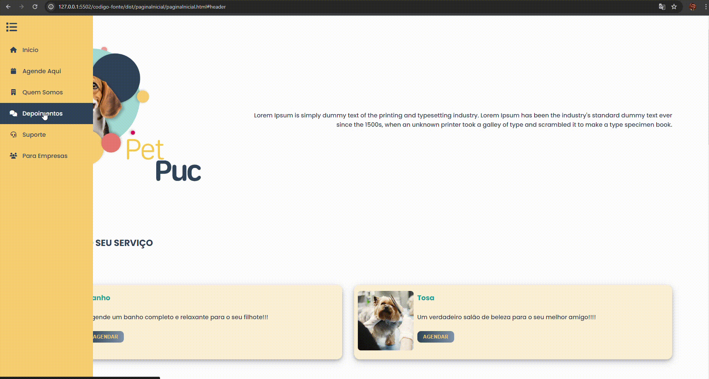
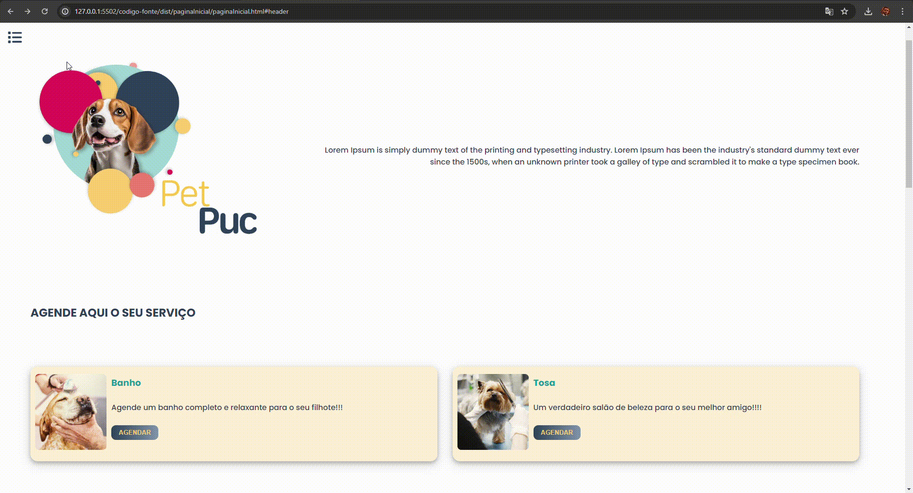
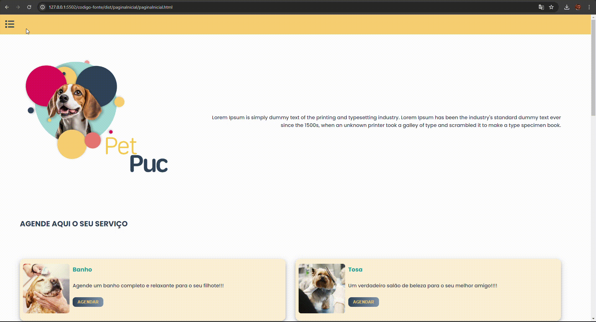
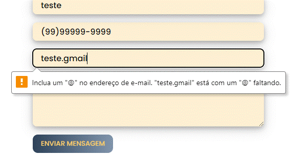
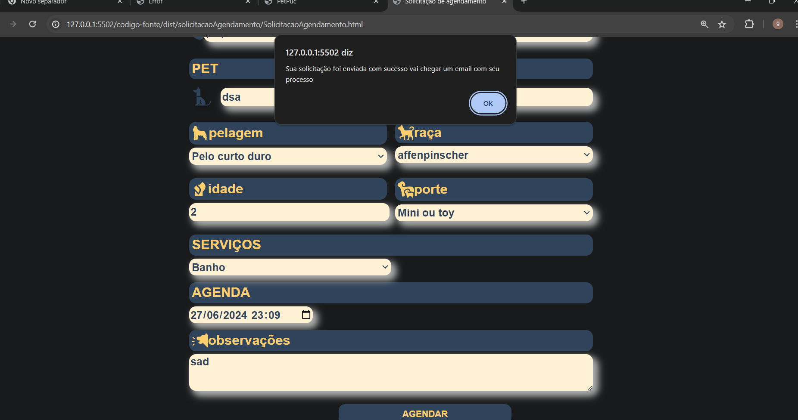

# Registro de Testes de Software

Relatório com as evidências dos testes de software realizados na aplicação pela equipe, baseado no plano de testes pré-definido.

Os resultados dos testes funcionais realizados na aplicação são descritos a seguir. [Utilize a estrutura abaixo para cada caso de teste executado]

|Caso de Teste    | CT-001 - Página Inicial - Menu Lateral - Itens "Inicio", "Quem Somos", "Depoimentos" e "Suporte" |
|:---|:---|
| Resultados obtidos | Navegação fluida, direcionamento correto para as devidas seções sem qualquer impedimentos.  |
| Responsável pela execução do caso de Teste | Paulo Henrique Sousa Carvalho |

 
 
 

|Caso de Teste    | CT-001.1 - Página Inicial - Menu Lateral - Item "Agende Aqui" |
|:---|:---|
| Resultados obtidos | Direcionamento correto página proposta.  |
| Responsável pela execução do caso de Teste | Paulo Henrique Sousa Carvalho |

 
 
 

|Caso de Teste    | CT-001.2 - Página Inicial - Menu Lateral - Item "Para Empresas" |
|:---|:---|
| Resultados obtidos | Direcionamento correto página proposta.  |
| Responsável pela execução do caso de Teste | Paulo Henrique Sousa Carvalho |

 
 
 

|Caso de Teste    | CT-001.3 - Página Inicial - Sessão Redes Sociais |
|:---|:---|
| Resultados obtidos | Direcionamento correto página proposta.  |
| Responsável pela execução do caso de Teste | Paulo Henrique Sousa Carvalho |

 
 
 

|Caso de Teste    | CT-004 - Preenchimento e envio da Solicitação de Suporte pelo cliente |
|:---|:---|
| Resultados obtidos | Inserção objetiva, formatação automática do número de telefone  |
| Responsável pela execução do caso de Teste | Paulo Henrique Sousa Carvalho |

 
 

Alert de erro no email quando não inserido da maneira correta:

 
 
 

|Caso de Teste    | CT-003 - Criação de agendamento pelo colaborador |
|:---|:---|
| Resultados obtidos | <li>Preenchimento correto de todos os campos do formulário; <li>Ao clicar no botão "Agendar" exibida a mensagem de sucesso "Criado novo agendamento!" corretamente; <li>Campos foram limpos corretamente quando clicado em "ok"; |
| Responsável pela execução do caso de Teste | João Henrique Andrade Leite |

Evidência Formulário Preenchido:
 
 

 
 
Evidência Mensagem de Êxito:
 
 

 
 

|Caso de Teste    | CT-005 - Tratamento das solicitações para agendamento de serviços |
|:---|:---|
| Resultados obtidos | <li>Correta visualização em lista das solicitações pendentes; <li>Ao clicar na linha da lista foi direcionado corretamente à pagina de tratamento da solicitação; <li>Clicando na opção alterar foi possível fazer as devidas alterações; <li> Clicando na opção recusar foi exibida corretamente a mensagem de sucesso para as ações de Recusar: "Solicitação recusada!"; <li> Clicando na opção recusar foi exibida corretamente a mensagem de sucesso para as ações de Aceitar: "Solicitação aceita!";  |
| Responsável pela execução do caso de Teste | João Henrique Andrade Leite |

Evidência Lista de Solicitações:
 
 

 
 
Evidência Filtro da Lista de Solicitações:
 
 

 
 
Evidência Alteração da Solicitação :
 
 

 
 
Evidência Aceite da Solicitação:
 
 

 
 
Evidência Recusa da Solicitação :
 
 

 
 

|Caso de Teste    | CT-006 - Tratamento das mensagens enviadas à equipe de suporte |
|:---|:---|
| Resultados obtidos | <li>Correta visualização em lista das mensagens de suporte que aguardam resposta; <li>Ao clicar na linha da lista foi direcionado corretamente à pagina de tratamento da solicitação; <li>Clicando na opção "Inserir Resposta" foi possível inserir texto de resposta; <li> Clicando na opção "Excluir" foi exibida corretamente a mensagem de sucesso para a ação: "Mensagem excluída!"; <li> Clicando na opção "Enviar" foi exibida corretamente a mensagem de sucesso para esta ação: "mensagem respondida!";  |
| Responsável pela execução do caso de Teste | João Henrique Andrade Leite |

Evidência Lista de Solicitações do Suporte:
 
 

 
 
Evidência Filtro da Lista de Solicitações do Suporte:
 
 

 
 
Evidência da inserção da resposta :
 
 

 
 
Evidência de envio da resposta:
 
 

 
 
Evidência exclusão da solicitação de suporte :
 
 

 
 

 

|Caso de Teste    | CT-002 - Criação de agendamento pelo cliente |
|:---|:---|
| Resultados obtidos | <li> Realização do  preenchimentos dos campos ; <li>Ao clicar para agendar a solicitação; <li>Clicando na opção agendar foi possível fazero agendamento ;  <li> Foi exibida corretamente a mensagem de sucesso para as ações de Aceitar: "Sua olicitação foi enviada com sucesso ...";  |
| Responsável pela execução do caso de Teste | Gabriel Marchi Ziviani  |

Evidência Lista de Solicitações:
 
 

 

|Caso de Teste    | CT-008 –Cadastro de Serviços Disponíveis |
|:---|:---|
| Resultados obtidos | <li> Preenchimento correto de todos os campos do formulário;<li> Campos foram limpos corretamente quando clicado em "Novo";<li> Ao clicar na opção " Aceitar" as informações cadastradas são enviadas e exibidas corretamente para na lista corretamente a “Lista de Serviços”; <li> Ao Clicar na opção "Excluir" é excluída corretamente a opção selecionada.<li> No Campo "pesquisa de serviço" é exibido somente serviços correspondentes a palavra digitada. <li> O campo permanece travado para edições até o usuário clicar na opção "alterar", clicando na opção alterar foi possível fazer as devidas alterações; <li>Correta visualização em lista dos novos serviços cadastrados;|
| Responsável pela execução do caso de Teste | Felipe Costa Moreira |

Evidência de preenchimento de formulário:

 
 
Evidência de inserção de item na Lista de Serviços :

 
 
Evidência exclusão de item :

 
 
Evidência Filtro da Lista de Serviços :

|Caso de Teste    | CT-009 - Cadastro de Usuários Colaboradores (Clientes) |
|:---|:---|
| Resultados obtidos | <li> A tela segue fielmente o protótipo, com os devidos campos, ícones, menu lateral, além dos botões de Novo, Alterar, Excluir e Salvar; <li> Realizei o  preenchimento dos campos para realizar o cadastro; <li>Ao clicar para salvar o registro, por enquanto não foi implementado o LocalStorage, para que eu realize a conferência do CRUD  |
| Responsável pela execução do caso de Teste | Thainá Crisóstomo Bernardes  |

Evidência Cadastro de Clientes:
 
 

 
